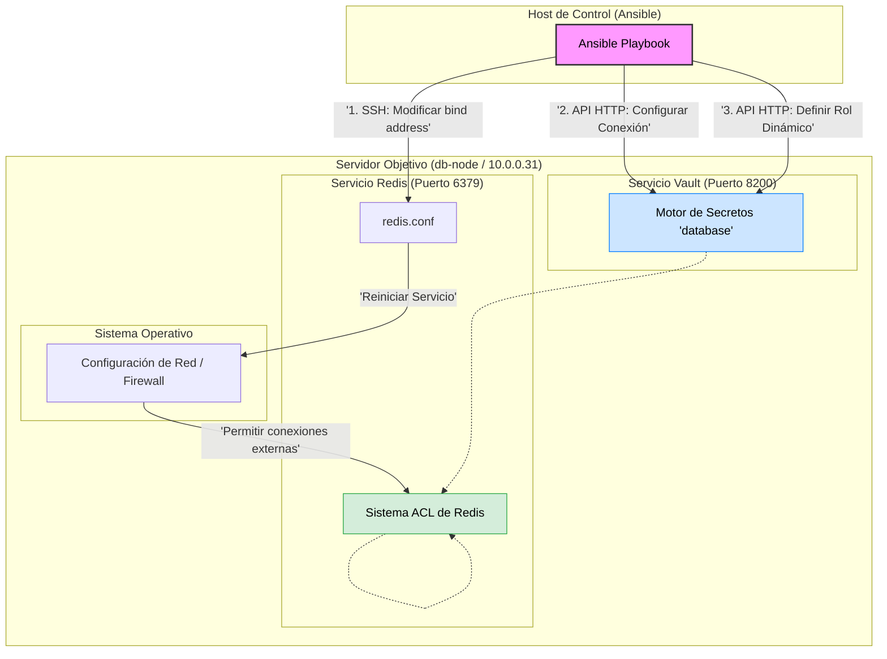

# Documentación de Arquitectura: Infraestructura de Secretos Dinámicos con Vault y Ansible

Esta documentación describe la arquitectura implementada para gestionar el acceso seguro a bases de datos mediante secretos dinámicos, utilizando HashiCorp Vault, Ansible y un flujo de trabajo de CI/CD en GitHub.

## 1. Introducción: El Problema y la Solución

En el desarrollo de software tradicional, las aplicaciones utilizan credenciales estáticas (usuarios y contraseñas fijos) para acceder a bases de datos y servicios. Estas credenciales suelen tener un ciclo de vida largo y se almacenan en archivos de configuración o variables de entorno, lo que representa un riesgo de seguridad significativo. Si estas credenciales se ven comprometidas, el acceso no autorizado persiste hasta que se rotan manualmente en todos los puntos de uso.

**La Solución: Secretos Dinámicos**

Hemos implementado un modelo de seguridad basado en **HashiCorp Vault** para transicionar de credenciales estáticas a dinámicas. En este modelo, las aplicaciones y servicios (como nuestros runners de CI/CD) no poseen credenciales permanentes para acceder a los servicios backend (PostgreSQL, Redis). En su lugar, se autentican contra Vault y solicitan acceso bajo demanda.

Vault actúa como un intermediario de confianza que:
1.  Verifica la identidad del solicitante.
2.  Se conecta al servicio backend utilizando privilegios administrativos.
3.  Genera dinámicamente un usuario y contraseña temporales con permisos mínimos y un Tiempo de Vida (TTL) corto.
4.  Entrega estas credenciales efímeras al solicitante.
5.  Revoca y elimina automáticamente las credenciales en el servicio backend una vez que expira el TTL.

## 2. Glosario de Conceptos Clave

* **IaC (Infrastructure as Code - Ansible):** Metodología para gestionar y aprovisionar la infraestructura a través de código en lugar de procesos manuales. Usamos Ansible para definir el estado deseado de nuestros servidores y servicios.
* **CI/CD (Continuous Integration/Continuous Deployment):** Práctica de automatizar la integración de cambios de código y su despliegue. Usamos GitHub Actions para orquestar nuestros pipelines de pruebas y despliegue.
* **Runner:** El servidor o agente encargado de ejecutar los trabajos definidos en el pipeline de CI/CD.
* **HashiCorp Vault:** Herramienta para gestionar secretos y proteger datos sensibles. Proporciona una interfaz unificada para acceder a secretos, manejar la autenticación y auditar el acceso.

### 1. ¿Qué es un "Secreto" en Vault?
**Concepto General**
En el mundo del desarrollo de software, un "secreto" es cualquier pieza de información sensible que no debe ser pública y cuyo acceso debe estar estrictamente controlado. Si esta información cae en manos equivocadas, podría comprometer tu sistema, tus datos o los de tus usuarios.

**Definición en Vault**
En HashiCorp Vault, un secreto es cualquier dato que Vault almacena de forma encriptada o que genera dinámicamente bajo demanda. Vault actúa como una caja fuerte digital: tú metes datos sensibles dentro, Vault cierra la puerta, encripta el contenido y solo permite abrirla a quien demuestre tener la llave correcta (autenticación) y el permiso adecuado (políticas).

Es importante distinguir entre dos tipos de secretos en Vault:

* **Secretos Estáticos (Static Secrets):** Son datos que tú guardas en Vault y que no cambian a menos que tú los actualices. Vault solo los almacena y los devuelve cuando se le piden.

* **Secretos Dinámicos (Dynamic Secrets):** Esta es la "magia" de Vault. No existen hasta que alguien los pide. Cuando una aplicación solicita un secreto dinámico, Vault se conecta al sistema destino (ej. una base de datos) y crea unas credenciales nuevas, únicas y temporales (con un tiempo de vida o TTL) solo para esa petición.

**Ejemplos Ilustrativos**
* **Ejemplo 1: Un Secreto Estático (KeyValue)** Imagina que tu aplicación necesita una clave de API para conectarse a un servicio de pagos externo como Stripe. Esta clave rara vez cambia.

   * **Sin Vault:** Guardarías la clave `sk_live_12345ABCDE` en un archivo `.env` en tu servidor o en el código fuente (¡muy mala práctica!).

   * **Con Vault:** Guardas la clave dentro del motor de secretos Key-Value (KV) de Vault en una ruta como `secret/pagos/stripe`. Cuando tu aplicación arranca, se autentica en Vault y lee el valor de esa ruta de forma segura.

* **Ejemplo 2: Un Secreto Dinámico (Base de Datos)** Este es el caso que hemos implementado en nuestro proyecto. Tu "Runner" de CI/CD necesita acceder a PostgreSQL para pasar unos tests.

   *  **Sin Vault:** Crearías un usuario runner_user con la contraseña `Passw0rd123!` en PostgreSQL y pondrías esas credenciales fijas en las variables de entorno de tu sistema de CI/CD. Si alguien roba esas variables, tiene acceso permanente a tu base de datos. 

   * **Con Vault:** El Runner le pide a Vault acceso a PostgreSQL. Vault se conecta a la base de datos y ejecuta un comando como: `CREATE USER "v-token-h2s8d7..." WITH PASSWORD "A1b2C3d4...";` Vault devuelve esas credenciales raras y temporales al Runner. Después de 1 hora (el TTL), Vault borrará automáticamente ese usuario. El secreto no existía antes de pedirlo y dejará de existir poco después.

### 2. ¿Qué es un "Role" en Vault?
**Concepto General**
La palabra "Rol" puede ser confusa porque se usa en muchos contextos (Roles de Ansible, Roles de IAM en AWS, etc.). En Vault, piensa en un Role como una plantilla de configuración o un perfil de comportamiento.

No es una identidad (como un usuario "Juan"), sino un conjunto de reglas que definen cómo Vault debe comportarse cuando alguien realiza una acción específica bajo ese perfil.

**Definición en Vault**
Un Role en Vault es una definición guardada que le dice a un "Motor de Secretos" (Secrets Engine) o a un "Método de Autenticación" (Auth Method) cómo debe actuar.

Hay principalmente dos tipos de roles que usarás:

* **Roles de Autenticación (Auth Roles):** Definen cómo una máquina o usuario debe presentarse para entrar en Vault y qué políticas de seguridad se le aplicarán una vez dentro.

* **Roles de Motores de Secretos (Secret Engine Roles):** Definen cómo se deben generar los secretos dinámicos. Son la "receta" que Vault sigue para crear un usuario temporal en otro sistema.

**Ejemplos Ilustrativos**
* **Ejemplo 1: Role de Autenticación (AppRole)** Necesitamos que nuestro servidor de CI/CD (una máquina, no una persona) pueda iniciar sesión en Vault. Usamos el método de autenticación AppRole.

Creamos un Role llamado `ci-runner` en Vault. Este Role no es el servidor en sí, sino la configuración que dice:

   * "Cualquiera que se loguee usando el perfil ci-runner necesita presentar un RoleID y un SecretID válidos".

   * "Una vez logueado, asígnale la política de seguridad llamada runner-policy (que solo le permite leer secretos de base de datos y nada más)".

Es como crear un tipo de "pase de visitante" en una empresa: el rol define qué puertas abre ese tipo de pase.

* **Ejemplo 2: Role de Motor de Secretos (Database Role)** Este es el ejemplo más claro en nuestro proyecto. Hemos configurado Vault para que pueda crear usuarios en Redis. ¿Pero qué tipo de usuarios? ¿Administradores? ¿Solo lectura?

Para definir esto, creamos un Role dentro del motor de bases de datos, por ejemplo, llamado `redis-readonly-role`. Este Role es una plantilla que contiene:

   * **La receta (Comandos):** "Cuando alguien pida credenciales usando este rol, ejecuta en Redis el comando ACL para crear un usuario que solo tenga permisos de lectura (`~* +@read`)".

   * **La caducidad (TTL):** "Las credenciales generadas con esta plantilla solo deben durar 30 minutos".

Cuando el Runner pide acceso, dice: "Dame credenciales de Redis usando el rol redis-readonly-role". Vault busca esa "receta" y la ejecuta.


---

## 3. Diagrama de Arquitectura y Flujos

```mermaid 

graph LR
    %% ============================================================
    %% 1. MÁQUINA DE DESARROLLO (Estructura de Carpetas y Control)
    %% ============================================================
    subgraph Dev_Machine ["1. MacBook (Ansible Control Node)"]
        direction TB
        
        %% Estructura de árbol de archivos
        A_root[mi-laboratorio-iac/]
        A_files[files/]
        A_gv_all[group_vars/all/]
        A_gv_db[group_vars/dbservers/]
        A_pb[playbooks/]
        R_vault["roles/vault_server"]

        A_root --> A_files;
        A_root --> A_gv_all;
        A_root --> A_gv_db;
        A_root --> A_pb;
        A_root --> R_vault;
        
        %% Ficheros Relevantes específicos
        F1["files/pg_master_password.txt"]
        F2["files/redis_master_password.txt"]
        GVDB1["dbservers/pg_secrets.yml (Vault)"]
        GVDB2["dbservers/redis_secrets.yml (Vault)"]
        PB1["playbooks/vault-config.yml"]
        
        A_files --> F1 & F2;
        A_gv_db --> GVDB1 & GVDB2;
        A_pb --> PB1;

        %% Motor de ejecución
        RB(Ansible Control Engine)
        PB1 -- "Ejecuta Playbook" --> RB;
    end 

    %% ============================================================
    %% 2. GITHUB (Sistema Externo de Control / CI)
    %% ============================================================
    subgraph GitHub ["2. GitHub (Plataforma CI/CD)"]
        direction TB
        G_wf[.github/workflows/ci_tests.yml]
        G_secrets[GitHub Secrets Store]
        GS1("🔑 VAULT_ROLE_ID & SECRET_ID")
        
        G_secrets -.-> |Almacena| GS1;
    end

    %% ============================================================
    %% 3. RUNNER NODE (Sistema Físico Separado - Ejecutor)
    %% ============================================================
    subgraph Runner_Node ["3. Runner-Node (Ejecutor CI - 10.0.0.23)"]
        direction TB
        %% Representamos los pasos del pipeline CI como una cadena lógica
        RN_Start((Inicio Job))
        J_VaultAuth[1. Login AppRole en Vault]
        J_GetCreds[2. Solicitar Credenciales Dinámicas]
        J_RunTests[3. Ejecutar Tests con Credenciales]
        RN_End(((Fin Job)))

        RN_Start --> J_VaultAuth --> J_GetCreds --> J_RunTests --> RN_End
    end

    %% ============================================================
    %% 4. DB NODE (Sistema Físico Separado - Objetivo)
    %% ============================================================
    subgraph DB_Node ["4. DB-Node (Servicios y Seguridad - 10.0.0.31)"]
        direction TB
        
        subgraph Targets ["Servicios Objetivo"]
            PG_S(🐘 PostgreSQL Server)
            R_S(🔴 Redis Server)
        end
        
        subgraph Vault_Server ["🔒 HashiCorp Vault Service (Puerto 8200)"]
            %% Método de Autenticación
            VA_AppRole(A-Method: approle/ci-runner)
            VA_Policy(Policy: runner-policy)
            
            %% Motores de Secretos y Roles
            subgraph PG_Engine ["Database Engine (PostgreSQL)"]
                VA_E_DB(Path: database/config/postgresql)
                VA_R_PG(Role: runner-role)
            end
             subgraph Redis_Engine ["Database Engine (Redis)"]
                VA_E_Redis(Path: database/config/redis-primary)
                VA_R_Redis(Role: redis-runner-role)
            end
            
            %% Relaciones internas de Vault
            VA_AppRole --> VA_Policy;
            VA_Policy -.-> |Permite acceso| VA_R_PG & VA_R_Redis;
            VA_E_DB -.-> |Usa| VA_R_PG;
            VA_E_Redis -.-> |Usa| VA_R_Redis;
        end
        
        %% Conexión de gestión interna (Vault -> Bases de datos)
        VA_E_DB == "Gestiona (Crear/Borrar Roles SQL)" ==> PG_S;
        VA_E_Redis == "Gestiona (ACLs SETUSER/DELUSER)" ==> R_S;
    end

    %% ============================================================
    %% CONEXIONES ENTRE SISTEMAS (EL FLUJO FÍSICO Y LÓGICO)
    %% ============================================================

    %% 1. Flujo de Configuración (Ansible -> Infraestructura)
    RB -- "SSH: Configura e Instala" --> DB_Node;
    RB -- "SSH: Mantenimiento/Limpieza" --> Runner_Node;

    %% 2. Flujo del Pipeline CI/CD (GitHub -> Runner)
    G_wf -- "Dispara Workflow (Trigger)" --> RN_Start;
    GS1 -.-> |"Inyecta como Variables de Entorno"| J_VaultAuth;

    %% 3. Flujo de Autenticación y Secretos (Runner -> Vault)
    J_VaultAuth -- "A. Autenticación (RoleID+SecretID)" --> VA_AppRole;
    %% (Vault devuelve token temporal al paso J_VaultAuth - implícito)
    
    J_GetCreds -- "B. Solicita Creds PG (con Token)" --> VA_R_PG;
    J_GetCreds -- "C. Solicita Creds Redis (con Token)" --> VA_R_Redis;
    %% (Vault crea usuarios en PG/Redis y devuelve creds a J_GetCreds - implícito)

    %% 4. Flujo de Conexión de Aplicación (Runner -> Bases de Datos)
    J_RunTests == "D. Conecta usando Credenciales Dinámicas" ==> PG_S;
    J_RunTests == "E. Conecta usando Credenciales Dinámicas" ==> R_S;


    %% ============================================================
    %% ESTILOS (Se han eliminado los estilos de flechas problemáticos)
    %% ============================================================
    style Dev_Machine fill:#6495ED, stroke:#00008B, stroke-width:3px, color:white;
    style GitHub fill:#F0F8FF, stroke:#333333, stroke-width:2px
    
```



## 4. Explicación Detallada de Componentes y Flujos
El diagrama se estructura en cuatro bloques principales que representan sistemas separados física o lógicamente.

### 4.1. Bloque 1: Máquina de Desarrollo (Ansible Control Node)
Este es el punto de origen de toda la configuración de infraestructura.

* **Propósito:** Alojar el código de IaC y ejecutar las herramientas de orquestación.

* **Componentes Clave:**

    * **Estructura de Proyecto:** Organización estándar de Ansible con playbooks (lógica de orquestación), roles (tareas reutilizables) e inventarios.

    * **Archivos Sensibles (files/, group_vars/):** Almacenan las credenciales administrativas iniciales (ej. pg_master_password.txt) necesarias para que Ansible pueda configurar los servicios por primera vez. Estos archivos deben protegerse (ej. usando Ansible Vault).

    * **Ansible Control Engine:** El ejecutable que procesa los playbooks y establece conexiones SSH con los nodos remotos para aplicar la configuración.

### 4.2. Bloque 2: GitHub (Plataforma CI/CD)
Actúa como el orquestador de los flujos de trabajo de integración continua.

* **Propósito:** Almacenar el código fuente, definir los pipelines de CI/CD y gestionar los secretos necesarios para la automatización.

* **Componentes Clave:**

* **Workflow (.github/workflows/ci_tests.yml):** Define los eventos que disparan la ejecución de pruebas y los pasos a seguir.

* **GitHub Secrets Store:** Almacén seguro para credenciales de CI/CD. Aquí residen las únicas credenciales permanentes que utiliza el runner: `VAULT_ROLE_ID` y `SECRET_ID`, necesarias para la autenticación con Vault.

### 4.3. Bloque 3: Runner-Node (Ejecutor CI - 10.0.0.23)
Un servidor dedicado a la ejecución de los trabajos del pipeline. Es un entorno efímero en términos de secretos; no almacena credenciales de forma persistente.

* **Flujo de Ejecución (Job):**

    1. **Login AppRole:** El runner recibe las credenciales de GitHub (RoleID/SecretID) como variables de entorno y las utiliza para autenticarse contra el método AppRole de Vault.

    2. **Solicitar Credenciales Dinámicas:** Una vez autenticado y con un token de Vault válido, solicita credenciales para los servicios backend (PostgreSQL, Redis) a través de los roles configurados en Vault.

    3. **Ejecutar Tests:** Recibe las credenciales temporales (usuario/contraseña) de Vault y las utiliza para conectarse directamente a los servicios en el DB-Node y ejecutar las pruebas.

### 4.4. Bloque 4: DB-Node (Servicios y Seguridad - 10.0.0.31)
El servidor central que aloja los datos y el servicio de seguridad.

* **Componentes Clave:**

    * **Servicios Objetivo:** Las instancias de PostgreSQL Server y Redis Server.

    * **HashiCorp Vault Service (Puerto 8200):**

        * **Auth Method (AppRole):** El mecanismo de autenticación para máquinas. Valida las credenciales del runner.

        * **Policy (runner-policy):** Define los permisos exactos del runner (ej. solo permiso para leer credenciales dinámicas, no para configurar Vault).

        * **Database Engines (PostgreSQL/Redis):** Módulos configurados con las credenciales administrativas de cada base de datos, permitiendo a Vault gestionar usuarios.

        * **Roles (runner-role, redis-runner-role):** Plantillas que definen cómo crear los usuarios temporales: qué comandos SQL/ACL ejecutar, qué permisos otorgar y qué TTL aplicar.

### 4.5. Descripción de los Flujos (Flechas)
El diagrama distingue entre dos tipos principales de flujos:

* **Flujo de Configuración (Flechas Rojas Superiores):** Iniciado manualmente desde la Máquina de Desarrollo. Ansible se conecta vía SSH a los nodos para instalar software y aplicar la configuración base (ej. configurar los Database Engines en Vault con las contraseñas maestras).

* **Flujo de Operación CI/CD (Resto de Flechas):**

1. GitHub dispara el workflow en el Runner-Node.

2. El Runner utiliza las credenciales inyectadas por GitHub para autenticarse con Vault (AppRole).

3. Vault verifica la identidad y devuelve un token temporal.

4. El Runner usa el token para solicitar credenciales dinámicas para una base de datos específica.

5. **Gestión Interna (Flechas Gruesas Verdes):** Vault intercepta la solicitud, se conecta al servicio backend usando su conexión administrativa y crea un usuario temporal según la definición del Rol.

6. Vault devuelve las credenciales temporales al Runner.

7. El Runner utiliza estas credenciales para conectarse directamente a los servicios objetivo y realizar sus tareas.

---

# Implementación de Secretos Dinámicos para Redis con HashiCorp Vault

## 1. Introducción y Propósito
El objetivo de esta configuración es pasar de un modelo de seguridad estático a uno dinámico para el acceso a nuestra base de datos Redis.

**El Problema (Modelo Estático):** Tradicionalmente, las aplicaciones usan una "contraseña maestra" de Redis de larga duración. Si esta contraseña se filtra, toda la base de datos se ve comprometida hasta que se rota la contraseña en todas partes.

**La Solución (Modelo Dinámico):** Utilizamos HashiCorp Vault. Vault actúa como un intermediario de confianza. Cuando una aplicación necesita acceder a Redis, no usa la contraseña maestra. En su lugar, le pide credenciales a Vault. Vault se conecta a Redis, crea un usuario temporal con permisos limitados y un tiempo de vida corto (TTL), y le entrega esas credenciales a la aplicación. Cuando el tiempo expira, el usuario se borra automáticamente.

## 2. Diagrama de Arquitectura y Flujo
Este diagrama ilustra los dos pasos principales que hemos automatizado con Ansible: preparar el servidor Redis y configurar el motor de secretos de Vault.




### 3. Explicación Detallada de la Configuración
Hemos dividido el proceso en tres pasos críticos que resolvimos durante la implementación.

### Paso 1: Preparar la Red de Redis (El problema del "Connection Refused")
**El Desafío:** Por defecto, Redis está configurado por seguridad para escuchar solo en la interfaz de loopback (127.0.0.1). Esto significa que solo acepta conexiones que provienen de la misma máquina. Aunque Vault esté en la misma máquina, al intentar conectarse usando la IP de la red (10.0.0.31), Redis rechazaba la conexión.

**La Solución:** Modificamos la configuración de Redis (/etc/redis/redis.conf) para que escuche en todas las interfaces de red (0.0.0.0).

**Lección Aprendida (Ansible y Regex):** Inicialmente, nuestra tarea de Ansible usaba una expresión regular muy genérica (^bind .*) para encontrar la línea a cambiar. Esto provocó que, si se ejecutaba varias veces, no reemplazara la línea restrictiva original, sino que añadiera líneas nuevas al final, creando una configuración conflictiva. Aprendimos a usar expresiones regulares (Regex) específicas para ser quirúrgicos en nuestros cambios.

**Fragmento de Código (Role redis_server):**

```YAML

# Archivo: roles/redis_server/tasks/main.yml

# Usamos lineinfile para buscar una línea específica y reemplazarla.
# La regex es clave aquí para asegurar que reemplazamos la configuración
# restrictiva original y no otra cosa.
- name: Modificar la configuración de Redis para escuchar en todas las interfaces (0.0.0.0)
  ansible.builtin.lineinfile:
    path: /etc/redis/redis.conf
    # EXPLICACIÓN DE LA REGEX:
    # ^\s*bind -> Busca líneas que empiecen por 'bind', ignorando espacios iniciales.
    # \s+      -> Seguido de uno o más espacios.
    # 127\.0\.0\.1 -> Busca Específicamente la IP local (escapando los puntos).
    # .* -> Coincide con cualquier cosa hasta el final de la línea.
    regexp: '^\s*bind\s+127\.0\.0\.1.*'
    line: 'bind 0.0.0.0'
    state: present
  notify: Reiniciar Redis
```

### Paso 2: Configurar la Conexión de Vault a Redis
**El Desafío:** Vault necesita "permiso root" en Redis para poder crear y borrar usuarios. Necesitamos decirle a Vault dónde está Redis y qué contraseña maestra usar.

**Lección Aprendida (Plugins de Base de Datos):** Intentamos inicialmente usar una cadena de conexión tipo URL (`redis://:password@host:port`), que es común en muchos sistemas. Sin embargo, descubrimos mediante pruebas que el plugin específico de Redis para Vault no maneja bien este formato. La solución robusta fue "deconstruir" la configuración y pasar cada parámetro (host, port, password) como un campo individual en el JSON que enviamos a la API de Vault.

**Fragmento de Código (Playbook vault-config.yml):**

```YAML

# Archivo: playbooks/vault_server/tasks/configure_redis.yml

# 1. Leemos la contraseña maestra del archivo local (donde Ansible la dejó previamente)
- name: "Redis | Leer la contraseña maestra desde el archivo local"
  ansible.builtin.slurp:
    src: "{{ playbook_dir }}/../files/redis_master_password.txt"
  register: redis_pass_file

# 2. Decodificamos el contenido (slurp devuelve base64)
- name: "Redis | Decodificar la contraseña maestra"
  ansible.builtin.set_fact:
    redis_master_password: "{{ redis_pass_file['content'] | b64decode | regex_replace('\\n', '') | trim }}"

# 3. Configuramos la conexión en Vault usando la API
- name: "Redis | Configurar la conexión del Motor de Base de Datos para Redis"
  community.hashi_vault.vault_write:
    url: "{{ vault_addr }}" # http://127.0.0.1:8200
    token: "{{ vault_token }}"
    path: database/config/redis-primary # El endpoint de configuración en Vault
    data:
      plugin_name: redis-database-plugin
      allowed_roles: ["redis-runner-role", "redis-readonly-role"]
      # IMPORTANTE: Pasamos los datos "deconstruidos", no como una sola URL.
      # Esto es específico de cómo funciona este plugin de Redis.
      host: "10.0.0.31"
      port: "6379"
      username: "default" # Redis < 6 suele usar 'default'
      password: "{{ redis_master_password }}"

```

### Paso 3: Definir el Rol Dinámico (La receta para crear usuarios)
El Desafío: Un "rol" en Vault es una plantilla. Le dice a Vault: "Cuando alguien te pida credenciales bajo el nombre 'redis-runner-role', ejecuta ESTE comando SQL (o ACL en el caso de Redis) para crear el usuario temporal".

**Lección Aprendida (Conflicto de Variables Jinja2 vs. Vault):** El comando para crear un usuario en Redis 6+ es: `ACL SETUSER <nombre_usuario> on ><contraseña> +@all ~*`.

Vault utiliza sus propias variables internas, `{{name}}` y `{{password}}`, que sustituirá dinámicamente al momento de crear el usuario.

El problema es que Ansible también usa `{{...}}` para sus variables (Jinja2). Cuando Ansible leía la tarea, intentaba reemplazar `{{name}}` y fallaba porque esa variable no existe en Ansible.

La solución es usar la directiva `!unsafe` de YAML. Esto le dice a Ansible: "Trata esta cadena como texto literal, no intentes interpretar lo que hay dentro de las llaves. Pásalo crudo a Vault".

**Fragmento de Código (Playbook vault-config.yml):**

```YAML

# Archivo: playbooks/vault_server/tasks/configure_redis.yml

- name: "Redis | Crear Rol Dinámico 'redis-runner-role'"
  community.hashi_vault.vault_write:
    url: "{{ vault_addr }}"
    token: "{{ vault_token }}"
    path: database/roles/redis-runner-role
    data:
      db_name: redis-primary
      default_ttl: "1h" # Tiempo de vida por defecto de las credenciales
      max_ttl: "24h"
      
      # PUNTOS CLAVE DE APRENDIZAJE:
      # 1. Usamos comandos ACL de Redis 6+ para definir permisos granulares.
      #    +@all: Permite todos los comandos.
      #    ~*: Permite acceso a todas las claves.
      #
      # 2. Uso de !unsafe:
      #    Es VITAL usar !unsafe aquí. Le dice a Ansible que ignore las llaves {{...}}.
      #    Si no lo hacemos, Ansible intentará buscar una variable llamada 'name' y fallará.
      #    Necesitamos que esas variables lleguen literales a Vault, que es quien las rellenará.
      creation_statements: !unsafe '["ACL SETUSER {{name}} on >{{password}} +@all ~*"]'
      revocation_statements: !unsafe '["ACL DELUSER {{name}}"]'
```

