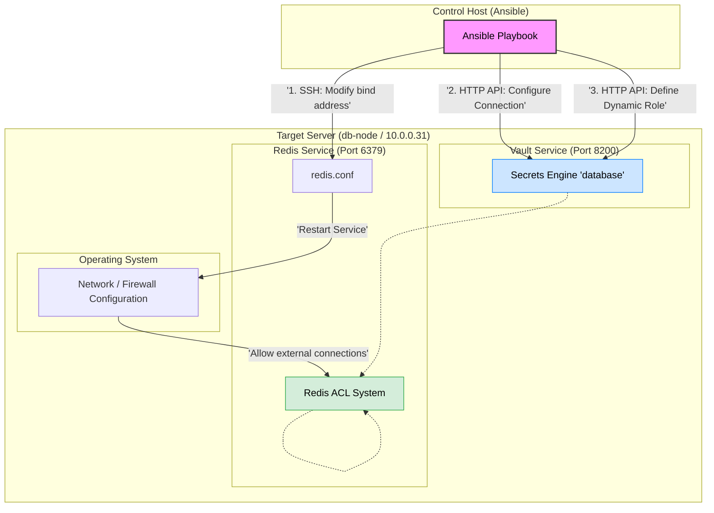

# Architecture Documentation: Dynamic Secrets Infrastructure with Vault and Ansible

This documentation describes the architecture implemented to manage secure database access through dynamic secrets, utilizing HashiCorp Vault, Ansible, and a CI/CD workflow in GitHub.

## 1. Introduction: The Problem and the Solution

In traditional software development, applications use static credentials (fixed usernames and passwords) to access databases and services. These credentials typically have a long lifecycle and are stored in configuration files or environment variables, representing a significant security risk. If these credentials are compromised, unauthorized access persists until they are manually rotated at every point of use.

**The Solution: Dynamic Secrets**

We have implemented a security model based on **HashiCorp Vault** to transition from static to dynamic credentials. In this model, applications and services (such as our CI/CD runners) do not possess permanent credentials to access backend services (PostgreSQL, Redis). Instead, they authenticate against Vault and request access on demand.

Vault acts as a trusted intermediary that:
1.  Verifies the identity of the requester.
2.  Connects to the backend service using administrative privileges.
3.  Dynamically generates a temporary username and password with minimum permissions and a short Time to Live (TTL).
4.  Delivers these ephemeral credentials to the requester.
5.  Automatically revokes and deletes the credentials from the backend service once the TTL expires.

## 2. Glossary of Key Concepts

* **IaC (Infrastructure as Code - Ansible):** Methodology for managing and provisioning infrastructure through code instead of manual processes. We use Ansible to define the desired state of our servers and services.
* **CI/CD (Continuous Integration/Continuous Deployment):** Practice of automating the integration of code changes and their deployment. We use GitHub Actions to orchestrate our testing and deployment pipelines.
* **Runner:** The server or agent responsible for executing the jobs defined in the CI/CD pipeline.
* **HashiCorp Vault:** A tool for managing secrets and protecting sensitive data. It provides a unified interface to access secrets, handle authentication, and audit access.

### 1. What is a "Secret" in Vault?
**General Concept**
In the world of software development, a "secret" is any piece of sensitive information that must not be public and whose access must be strictly controlled. If this information falls into the wrong hands, it could compromise your system, your data, or your users' data.

**Definition in Vault**
In HashiCorp Vault, a secret is any data that Vault stores in an encrypted format or generates dynamically on demand. Vault acts as a digital safe: you put sensitive data inside, Vault closes the door, encrypts the content, and only allows it to be opened by someone who demonstrates they have the correct key (authentication) and the proper permission (policies).

It is important to distinguish between two types of secrets in Vault:

* **Static Secrets:** These are data points that you save in Vault and do not change unless you update them. Vault simply stores them and returns them when requested.
* **Dynamic Secrets:** This is the "magic" of Vault. They do not exist until someone asks for them. When an application requests a dynamic secret, Vault connects to the target system (e.g., a database) and creates new, unique, and temporary credentials (with a Time to Live or TTL) solely for that request.

**Illustrative Examples**
* **Example 1: A Static Secret (KeyValue):** Imagine your application needs an API key to connect to an external payment service like Stripe. This key rarely changes.
    * **Without Vault:** You would store the key `sk_live_12345ABCDE` in an `.env` file on your server or in the source code (very bad practice!).
    * **With Vault:** You store the key inside Vault's Key-Value (KV) secrets engine at a path like `secret/payments/stripe`. When your application starts, it authenticates with Vault and reads the value from that path securely.
* **Example 2: A Dynamic Secret (Database):** This is the case we have implemented in our project. Your CI/CD "Runner" needs to access PostgreSQL to run some tests.
    * **Without Vault:** You would create a user `runner_user` with the password `Passw0rd123!` in PostgreSQL and put those fixed credentials in the environment variables of your CI/CD system. If someone steals those variables, they have permanent access to your database.
    * **With Vault:** The Runner asks Vault for access to PostgreSQL. Vault connects to the database and executes a command like: `CREATE USER "v-token-h2s8d7..." WITH PASSWORD "A1b2C3d4...";`. Vault returns these unique and temporary credentials to the Runner. After 1 hour (the TTL), Vault will automatically delete that user. The secret did not exist before it was requested and will cease to exist shortly after.

### 2. What is a "Role" in Vault?
**General Concept**
The word "Role" can be confusing because it is used in many contexts (Ansible Roles, AWS IAM Roles, etc.). In Vault, think of a Role as a configuration template or a behavior profile. It is not an identity (like a user named "John"), but a set of rules defining how Vault should behave when someone performs a specific action under that profile.

**Definition in Vault**
A Role in Vault is a saved definition that tells a "Secrets Engine" or an "Auth Method" how it should act. There are mainly two types of roles you will use:

* **Auth Roles:** They define how a machine or user must present themselves to enter Vault and what security policies will be applied to them once inside.
* **Secret Engine Roles:** They define how dynamic secrets should be generated. They are the "recipe" Vault follows to create a temporary user in another system.

**Illustrative Examples**
* **Example 1: Authentication Role (AppRole):** We need our CI/CD server (a machine, not a person) to be able to log into Vault. We use the AppRole authentication method. We create a Role called `ci-runner` in Vault. This Role is the configuration that says:
    * "Anyone logging in using the `ci-runner` profile must present a valid RoleID and SecretID."
    * "Once logged in, assign them the security policy called `runner-policy` (which only allows them to read database secrets and nothing else)."

  It is like creating a 'visitor pass' in a company: the role defines which doors that specific type of pass opens.

* **Example 2: Secrets Engine Role (Database Role):** This is the clearest example in our project. We have configured Vault so it can create users in Redis. But what kind of users? Administrators? Read-only? To define this, we create a Role within the database engine, for example, called `redis-readonly-role`. This Role is a template containing:
    * **The recipe (Commands):** "When someone requests credentials using this role, execute the ACL command in Redis to create a user that only has read permissions (`~* +@read`)."
    * **The expiration (TTL):** "Credentials generated with this template should only last 30 minutes."

---

## 3. Architecture Diagram and Flows

```mermaid 

graph LR
    %% ============================================================
    %% 1. MÁQUINA DE DESARROLLO (Estructura de Carpetas y Control)
    %% ============================================================
    subgraph Dev_Machine ["1. MacBook (Ansible Control Node)"]
        direction TB
        
        %% Estructura de árbol de archivos
        A_root[mi-laboratorio-iac/]
        A_files[files/]
        A_gv_all[group_vars/all/]
        A_gv_db[group_vars/dbservers/]
        A_pb[playbooks/]
        R_vault["roles/vault_server"]

        A_root --> A_files;
        A_root --> A_gv_all;
        A_root --> A_gv_db;
        A_root --> A_pb;
        A_root --> R_vault;
        
        %% Ficheros Relevantes específicos
        F1["files/pg_master_password.txt"]
        F2["files/redis_master_password.txt"]
        GVDB1["dbservers/pg_secrets.yml (Vault)"]
        GVDB2["dbservers/redis_secrets.yml (Vault)"]
        PB1["playbooks/vault-config.yml"]
        
        A_files --> F1 & F2;
        A_gv_db --> GVDB1 & GVDB2;
        A_pb --> PB1;

        %% Motor de ejecución
        RB(Ansible Control Engine)
        PB1 -- "Ejecuta Playbook" --> RB;
    end 

    %% ============================================================
    %% 2. GITHUB (Sistema Externo de Control / CI)
    %% ============================================================
    subgraph GitHub ["2. GitHub (Plataforma CI/CD)"]
        direction TB
        G_wf[.github/workflows/ci_tests.yml]
        G_secrets[GitHub Secrets Store]
        GS1("🔑 VAULT_ROLE_ID & SECRET_ID")
        
        G_secrets -.-> |Almacena| GS1;
    end

    %% ============================================================
    %% 3. RUNNER NODE (Sistema Físico Separado - Ejecutor)
    %% ============================================================
    subgraph Runner_Node ["3. Runner-Node (Ejecutor CI - 10.0.0.23)"]
        direction TB
        %% Representamos los pasos del pipeline CI como una cadena lógica
        RN_Start((Inicio Job))
        J_VaultAuth[1. Login AppRole en Vault]
        J_GetCreds[2. Solicitar Credenciales Dinámicas]
        J_RunTests[3. Ejecutar Tests con Credenciales]
        RN_End(((Fin Job)))

        RN_Start --> J_VaultAuth --> J_GetCreds --> J_RunTests --> RN_End
    end

    %% ============================================================
    %% 4. DB NODE (Sistema Físico Separado - Objetivo)
    %% ============================================================
    subgraph DB_Node ["4. DB-Node (Servicios y Seguridad - 10.0.0.31)"]
        direction TB
        
        subgraph Targets ["Servicios Objetivo"]
            PG_S(🐘 PostgreSQL Server)
            R_S(🔴 Redis Server)
        end
        
        subgraph Vault_Server ["🔒 HashiCorp Vault Service (Puerto 8200)"]
            %% Método de Autenticación
            VA_AppRole(A-Method: approle/ci-runner)
            VA_Policy(Policy: runner-policy)
            
            %% Motores de Secretos y Roles
            subgraph PG_Engine ["Database Engine (PostgreSQL)"]
                VA_E_DB(Path: database/config/postgresql)
                VA_R_PG(Role: runner-role)
            end
             subgraph Redis_Engine ["Database Engine (Redis)"]
                VA_E_Redis(Path: database/config/redis-primary)
                VA_R_Redis(Role: redis-runner-role)
            end
            
            %% Relaciones internas de Vault
            VA_AppRole --> VA_Policy;
            VA_Policy -.-> |Permite acceso| VA_R_PG & VA_R_Redis;
            VA_E_DB -.-> |Usa| VA_R_PG;
            VA_E_Redis -.-> |Usa| VA_R_Redis;
        end
        
        %% Conexión de gestión interna (Vault -> Bases de datos)
        VA_E_DB == "Gestiona (Crear/Borrar Roles SQL)" ==> PG_S;
        VA_E_Redis == "Gestiona (ACLs SETUSER/DELUSER)" ==> R_S;
    end

    %% ============================================================
    %% CONEXIONES ENTRE SISTEMAS (EL FLUJO FÍSICO Y LÓGICO)
    %% ============================================================

    %% 1. Flujo de Configuración (Ansible -> Infraestructura)
    RB -- "SSH: Configura e Instala" --> DB_Node;
    RB -- "SSH: Mantenimiento/Limpieza" --> Runner_Node;

    %% 2. Flujo del Pipeline CI/CD (GitHub -> Runner)
    G_wf -- "Dispara Workflow (Trigger)" --> RN_Start;
    GS1 -.-> |"Inyecta como Variables de Entorno"| J_VaultAuth;

    %% 3. Flujo de Autenticación y Secretos (Runner -> Vault)
    J_VaultAuth -- "A. Autenticación (RoleID+SecretID)" --> VA_AppRole;
    %% (Vault devuelve token temporal al paso J_VaultAuth - implícito)
    
    J_GetCreds -- "B. Solicita Creds PG (con Token)" --> VA_R_PG;
    J_GetCreds -- "C. Solicita Creds Redis (con Token)" --> VA_R_Redis;
    %% (Vault crea usuarios en PG/Redis y devuelve creds a J_GetCreds - implícito)

    %% 4. Flujo de Conexión de Aplicación (Runner -> Bases de Datos)
    J_RunTests == "D. Conecta usando Credenciales Dinámicas" ==> PG_S;
    J_RunTests == "E. Conecta usando Credenciales Dinámicas" ==> R_S;


    %% ============================================================
    %% ESTILOS (Se han eliminado los estilos de flechas problemáticos)
    %% ============================================================
    style Dev_Machine fill:#6495ED, stroke:#00008B, stroke-width:3px, color:white;
    style GitHub fill:#F0F8FF, stroke:#333333, stroke-width:2px
    
```



## 4. Detailed Explanation of Components and Flows
The diagram is structured into four main blocks representing physically or logically separated systems.

### 4.1. Block 1: Development Machine (Ansible Control Node)
This is the starting point for all infrastructure configuration.
* **Purpose:** To host the IaC code and run orchestration tools.
* **Key Components:**
    * **Project Structure:** Standard Ansible organization with playbooks (orchestration logic), roles (reusable tasks), and inventories.
    * **Sensitive Files (files/, group_vars/):** These store initial administrative credentials (e.g., `pg_master_password.txt`) required for Ansible to configure services for the first time. These files must be protected (e.g., using Ansible Vault).
    * **Ansible Control Engine:** The executable that processes playbooks and establishes SSH connections with remote nodes to apply configuration.

### 4.2. Block 2: GitHub (CI/CD Platform)
Acts as the orchestrator for continuous integration workflows.
* **Purpose:** To store source code, define CI/CD pipelines, and manage secrets required for automation.
* **Key Components:**
    * **Workflow (.github/workflows/ci_tests.yml):** Defines the events that trigger test execution and the steps to follow.
    * **GitHub Secrets Store:** Secure storage for CI/CD credentials. This is where the only permanent credentials used by the runner reside: `VAULT_ROLE_ID` and `SECRET_ID`, required for Vault authentication.

### 4.3. Block 3: Runner-Node (CI Executor - 10.0.0.23)
A server dedicated to executing pipeline jobs. It is an ephemeral environment regarding secrets; it does not store credentials persistently.
* **Execution Flow (Job):**
    1.  **AppRole Login:** The runner receives credentials from GitHub (RoleID/SecretID) as environment variables and uses them to authenticate against Vault's AppRole method.
    2.  **Request Dynamic Credentials:** Once authenticated and holding a valid Vault token, it requests credentials for backend services (PostgreSQL, Redis) through the roles configured in Vault.
    3.  **Run Tests:** It receives temporary credentials (username/password) from Vault and uses them to connect directly to the services on the DB-Node to execute tests.

### 4.4. Block 4: DB-Node (Services and Security - 10.0.0.31)
The central server hosting data and the security service.
* **Key Components:**
    * **Target Services:** Instances of PostgreSQL Server and Redis Server.
    * **HashiCorp Vault Service (Port 8200):**
        * **Auth Method (AppRole):** The authentication mechanism for machines. Validates the runner's credentials.
        * **Policy (runner-policy):** Defines exact permissions for the runner (e.g., only permission to read dynamic credentials, not to configure Vault).
        * **Database Engines (PostgreSQL/Redis):** Modules configured with the administrative credentials of each database, allowing Vault to manage users.
        * **Roles (runner-role, redis-runner-role):** Templates defining how to create temporary users: which SQL/ACL commands to run, what permissions to grant, and what TTL to apply.

### 4.5. Description of Flows (Arrows)
The diagram distinguishes between two main types of flows:
* **Configuration Flow (Top Blue Arrows):** Initiated manually from the Development Machine. Ansible connects via SSH to nodes to install software and apply base configuration (e.g., configuring Database Engines in Vault with master passwords).
* **CI/CD Operation Flow (Remaining Arrows):**
  
    1.  GitHub triggers the workflow on the Runner-Node.
   
    2.  The Runner uses credentials injected by GitHub to authenticate with Vault (AppRole).
   
    3.  Vault verifies identity and returns a temporary token.
   
    4.  The Runner uses the token to request dynamic credentials for a specific database.
   
    5.  **Internal Management (Thick Green Arrows):** Vault intercepts the request, connects to the backend service using its administrative connection, and creates a temporary user based on the Role definition.
   
    6.  Vault returns temporary credentials to the Runner.
   
    7.  The Runner uses these credentials to connect directly to target services and perform its tasks.

---


# Implementation of Dynamic Secrets for Redis with HashiCorp Vault

## 1. Introduction and Purpose
The goal of this configuration is to move from a static security model to a dynamic one for accessing our Redis database.

**The Problem (Static Model):** Traditionally, applications use a long-lived Redis "master password". If this password leaks, the entire database is compromised until the password is rotated everywhere.

**The Solution (Dynamic Model):** We use HashiCorp Vault. Vault acts as a trusted intermediary. When an application needs access to Redis, it doesn't use the master password. Instead, it asks Vault for credentials. Vault connects to Redis, creates a temporary user with limited permissions and a short Time to Live (TTL), and delivers those credentials to the application. When the time expires, the user is automatically deleted.

## 2. Architecture and Flow Diagram
This diagram illustrates the two main steps we have automated with Ansible: preparing the Redis server and configuring the Vault secrets engine.



## 3. Detailed Configuration Explanation
We have divided the process into three critical steps that were resolved during the implementation.

### Step 1: Preparing the Redis Network (The "Connection Refused" issue)
**The Challenge:** By default, Redis is configured for security to listen only on the loopback interface (`127.0.0.1`). This means it only accepts connections originating from the same machine. Even though Vault was on the same machine, when attempting to connect using the network IP (`10.0.0.31`), Redis rejected the connection.

**The Solution:** We modified the Redis configuration (`/etc/redis/redis.conf`) to listen on all network interfaces (`0.0.0.0`).

**Lesson Learned (Ansible and Regex):** Initially, our Ansible task used a very generic regular expression (`^bind .*`) to find the line to change. This caused a problem where, if executed multiple times, it would not replace the original restrictive line but instead add new lines at the end, creating a conflicting configuration. We learned to use specific Regular Expressions (Regex) to be surgical with our changes.

**Code Snippet (redis_server role):**

```yaml
# File: roles/redis_server/tasks/main.yml

# We use lineinfile to search for a specific line and replace it.
# The regex is key here to ensure we replace the original 
# restrictive configuration and nothing else.
- name: "Modify Redis configuration to listen on all interfaces (0.0.0.0)"
  ansible.builtin.lineinfile:
    path: /etc/redis/redis.conf
    # REGEX EXPLANATION:
    # ^\s*bind -> Matches lines starting with 'bind', ignoring leading spaces.
    # \s+      -> Followed by one or more spaces.
    # 127\.0\.0\.1 -> Specifically matches the local IP (escaping the dots).
    # .* -> Matches anything until the end of the line.
    regexp: '^\s*bind\s+127\.0\.0\.1.*'
    line: 'bind 0.0.0.0'
    state: present
  notify: Restart Redis
  ```

### Step 2: Configuring Vault's Connection to Redis
**The Challenge:** Vault requires "root-level permissions" in Redis to be able to create and delete users. We need to provide Vault with the Redis location and the master password to be used.

**Lesson Learned (Database Plugins):** We initially attempted to use a URL-style connection string (`redis://:password@host:port`), which is common in many systems. However, through testing, we discovered that the specific Redis plugin for Vault does not handle this format correctly. The robust solution was to "deconstruct" the configuration and pass each parameter (host, port, password) as an individual field in the JSON payload sent to the Vault API.

**Code Snippet (vault-config.yml playbook):**

```yaml
# File: playbooks/vault_server/tasks/configure_redis.yml

# 1. Read the master password from the local file (where Ansible previously stored it)
- name: "Redis | Read master password from local file"
  ansible.builtin.slurp:
    src: "{{ playbook_dir }}/../files/redis_master_password.txt"
  register: redis_pass_file

# 2. Decode the content (slurp returns base64)
- name: "Redis | Decode master password"
  ansible.builtin.set_fact:
    redis_master_password: "{{ redis_pass_file['content'] | b64decode | regex_replace('\\n', '') | trim }}"

# 3. Configure the connection in Vault using the API
- name: "Redis | Configure Database Engine connection for Redis"
  community.hashi_vault.vault_write:
    url: "{{ vault_addr }}" # [http://127.0.0.1:8200](http://127.0.0.1:8200)
    token: "{{ vault_token }}"
    path: database/config/redis-primary # Vault configuration endpoint
    data:
      plugin_name: redis-database-plugin
      allowed_roles: ["redis-runner-role", "redis-readonly-role"]
      # IMPORTANT: We pass "deconstructed" data, not as a single URL.
      # This is specific to how this Redis plugin operates.
      host: "10.0.0.31"
      port: "6379"
      username: "default" # Redis < 6 usually uses 'default'
      password: "{{ redis_master_password }}"
```

### Step 3: Defining the Dynamic Role (The "Recipe" for User Creation)
**The Challenge:** A "role" in Vault is a template. It tells Vault: "When someone requests credentials under the name 'redis-runner-role', execute THIS ACL command (or SQL command) to create the temporary user."

**Lesson Learned (Jinja2 vs. Vault Variable Conflict):** The command to create a user in Redis 6+ is: `ACL SETUSER <username> on ><password> +@all ~*`. Vault uses its own internal variables, `{{name}}` and `{{password}}`, which it substitutes dynamically at the time of user creation.

The problem is that Ansible also uses `{{ ... }}` for its variables (Jinja2). When Ansible reads the task, it tries to replace `{{name}}` and fails because that variable does not exist in the Ansible context. The solution is to use the `!unsafe` YAML directive. This tells Ansible: "Treat this string as literal text; do not attempt to interpret what is inside the curly braces. Pass it raw to Vault."

**Code Snippet (vault-config.yml playbook):**

```yaml
# File: playbooks/vault_server/tasks/configure_redis.yml

- name: "Redis | Create Dynamic Role 'redis-runner-role'"
  community.hashi_vault.vault_write:
    url: "{{ vault_addr }}"
    token: "{{ vault_token }}"
    path: database/roles/redis-runner-role
    data:
      db_name: redis-primary
      default_ttl: "1h" # Default credential lifetime
      max_ttl: "24h"
      
      # KEY LEARNING POINTS:
      # 1. We use Redis 6+ ACL commands to define granular permissions.
      #    +@all: Allows all commands.
      #    ~*: Allows access to all keys.
      #
      # 2. Use of !unsafe:
      #    It is CRITICAL to use !unsafe here. It tells Ansible to ignore the {{ ... }} braces.
      #    If we don't, Ansible will look for a variable named 'name' and fail.
      #    We need these variables to reach Vault literally, as Vault will be the one to populate them.
      creation_statements: !unsafe '["ACL SETUSER {{name}} on >{{password}} +@all ~*"]'
      revocation_statements: !unsafe '["ACL DELUSER {{name}}"]'
      ```