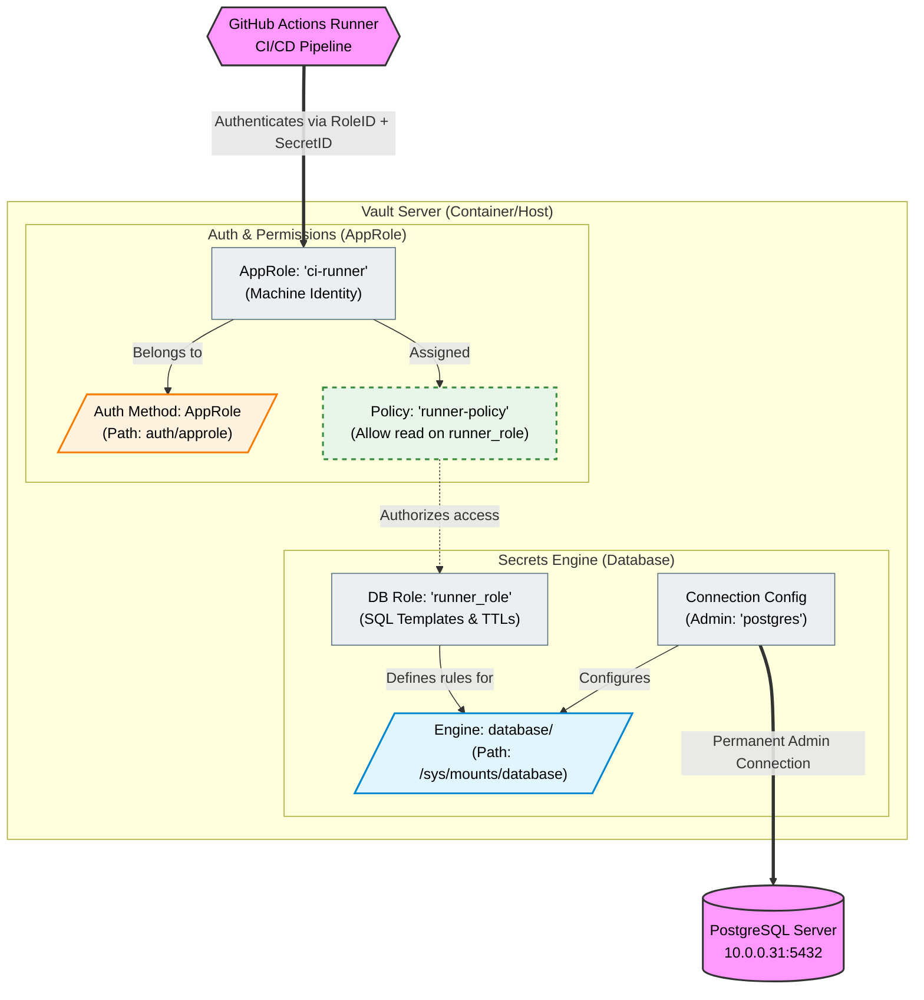
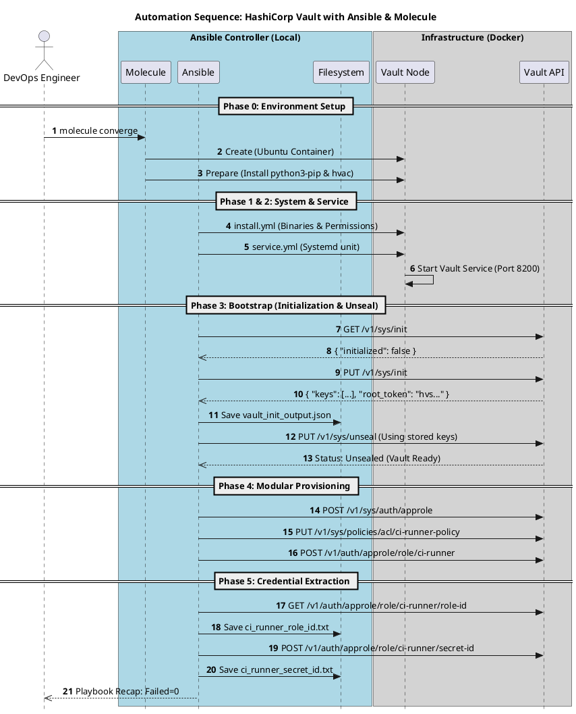
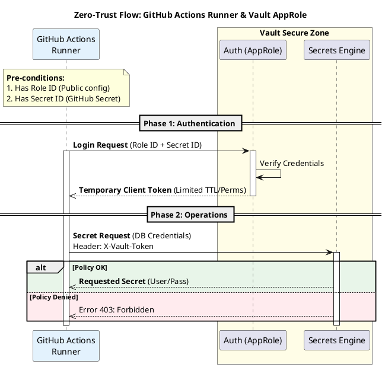

# Ansible Role: vault_server

A high-performance Ansible role designed for the automated deployment, bootstrapping, and modular provisioning of **HashiCorp Vault**. This role simulates a complete **"Secrets as a Service"** environment, integrating Vault with external databases (PostgreSQL) and generating secure machine identities (AppRole) for modern CI/CD pipelines.

---

## 🚀 Key Features

* **Zero-Trust Architecture**: Implements the principle of least privilege by replacing Root Tokens with specific AppRoles.
* **Automated Bootstrap**: Handles the critical `init` and `unseal` lifecycle, persisting master keys locally on the controller.
* **Modular Provisioning**: Orchestrates Auth Methods, ACL Policies, and Secrets Engines via Vault API.
* **Dynamic Secrets Engine**: Ready-to-use integration with **PostgreSQL**, generating on-demand users with limited TTLs.
* **Hybrid Testing Architecture**: Scenarios tested via internal Docker networks and validated from the host machine via port mapping.
* **Industrial-Grade Testing**: Full lifecycle validation using **Molecule**, **Testinfra**, and **Pytest-BDD** (Gherkin style).
* **Strict Idempotency**: Advanced logic for API state comparison (handling complex nested JSON responses).

---

## 📋 Prerequisites & System Dependencies

To maintain reproducibility across different environments (Mac/Linux), ensure the following system-level dependencies are installed on your **controller/runner**:

### **macOS (Homebrew)**
The integration tests require PostgreSQL client headers to link the Python `psycopg2` driver during host-based verification.
```bash
brew install postgresql  # Essential for psycopg2-binary to link correctly on the host
```

### **Python Environment**
```bash
pip install -r requirements.txt
```
*Note: The environment includes `hvac` for Vault API and `psycopg2-binary` for database connectivity tests.*

---

## 🏗️ Architecture Overview

This role establishes a secure bridge between your GitHub Actions Runner and your target infrastructure, using Vault as the centralized identity broker.



---

## 📂 Project Structure

The role follows the standard Ansible hierarchy with specialized provisioning modules:

```text
.
├── README.md               # Main documentation
├── requirements.txt          # Python dependencies (hvac, psycopg2, etc.)
├── defaults
│   └── main.yml            # Role variables and defaults
├── files
│   ├── ci-runner-policy.hcl      # ACL definition
│   ├── ci_runner_role_id.txt     # Extracted RoleID (Generated)
│   ├── ci_runner_secret_id.txt   # Extracted SecretID (Generated)
│   └── vault_init_output.json    # Master keys/Root Token (Generated)
├── handlers
│   └── main.yml            # Service restart logic
├── tasks
│   ├── main.yml            # Main orchestrator
│   ├── install.yml         # Binary deployment and OS users
│   ├── service.yml         # Systemd unit configuration
│   ├── bootstrap.yml       # Critical: Init & Unseal logic
│   ├── provision.yml       # API configuration bridge
│   └── provisioning/       # API-specific logic (vault_write)
│       ├── auth/           # Auth backends (AppRole)
│       ├── engines/        # Secrets engines (DB, Redis)
│       ├── policies/       # ACL Policy management
│       └── roles/          # AppRole and DB role definitions
├── molecule/               # Testing lab
│   ├── default/            # Unit testing scenario
│   └── integration-postgres/ # Advanced integration scenario
│       ├── molecule.yml      # Configures Port Mapping (8200, 5432)
│       └── tests/            # BDD Verification (test_postgres_integration.py)
└── templates
    ├── vault.hcl.j2        # Vault HCL configuration template
    └── vault.service.j2    # Systemd service template
```

---

## ⚙️ Key Variables Glossary (`defaults/main.yml`)

| Variable | Purpose | Default / Example |
| :--- | :--- | :--- |
| `vault_version` | HashiCorp Vault binary version to download. | `1.15.4` |
| `vault_addr` | Local URL where the Vault API listens. | `http://127.0.0.1:8200` |
| `vault_config_dir` | System directory for `vault.hcl`. | `/etc/vault.d` |
| `vault_data_dir` | Persistence directory for the storage backend. | `/opt/vault/data` |
| `vault_unseal_keys_dir` | Local path on the controller to persist master keys. | `{{ role_path }}/files` |
| `vault_enabled_app_roles` | List of AppRoles to provision in the API. | `['ci-runner']` |

---

## 🔄 Automation Workflows

### 1. Provisioning Sequence
This diagram represents the full lifecycle from `molecule converge` to final credential persistence.



### 2. Runtime Zero-Trust Flow
How the GitHub Actions Runner interacts with the provisioned Vault server.



---

## 🧪 Testing and Quality Assurance

### Molecule Scenarios
* **`default`**: Validates the core role installation, bootstrap, and basic BDD requirements.
* **`integration-postgres`**: Advanced scenario for testing dynamic secrets connectivity with real PostgreSQL instances.

### BDD Validation (Gherkin)
The role uses `pytest-bdd` to verify business requirements. It includes dynamic path resolution for CI compatibility:
```python
BASE_DIR = os.path.dirname(os.path.abspath(__file__))
TOKEN_PATH = os.path.abspath(os.path.join(BASE_DIR, "../../../files/vault_init_output.json"))
```

---

## 🧪 Testing Strategy

This role uses a **Matrix Testing** approach to ensure reliability across different scopes.

### **1. Port-Mapping Verification**
To allow `pytest-bdd` (running on your Mac/Runner) to verify the integration, ports are published from Docker to `localhost`. This simulates a real application attempting to fetch secrets and connect to a database from outside the cluster.

### **2. Execution Commands**
```bash
# Run the default smoke test
molecule test -s default

# Run the full PostgreSQL integration cycle
molecule test -s integration-postgres
```

---

## 🤖 CI/CD Automation (GitHub Actions)

The repository includes a matrix-based workflow that runs all scenarios in parallel on a **Self-Hosted macOS Runner**.

```yaml
strategy:
  fail-fast: false
  matrix:
    scenario: [default, integration-postgres]
steps:
  - name: Run Molecule Scenario
    run: molecule test -s ${{ matrix.scenario }}
```


### Execution Commands
```bash
# Full test cycle (Recommended for CI)
molecule test

# Fast development feedback
molecule converge    # Apply changes
molecule idempotence # Check for redundant changes
molecule verify      # Run BDD tests
```

---

## 🛡️ Security Note


The files generated in `roles/vault_server/files/` (`vault_init_output.json`, `ci_runner_secret_id.txt`) contain **plain-text secrets**. 

1. *Ephemeral Secrets**: Master keys (`vault_init_output.json`) are generated during the `bootstrap` phase and stored locally in `files/`.
2.  **Git Hygiene**: The `files/` directory is explicitly excluded in `.gitignore` to prevent accidental leakage of Root Tokens.
3.  In production, use **Ansible Vault** to encrypt sensitive artifacts.
4.  **AppRole Identities**: Encourages `RoleID` and `SecretID` for machine-to-machine authentication, avoiding long-lived root tokens.


---
**Maintained by:** Luis Iglesias - Thought Partner: Gemini.

