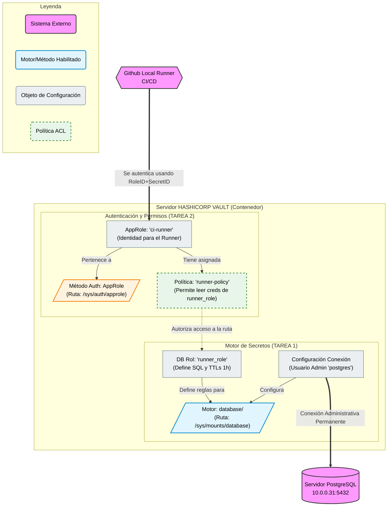
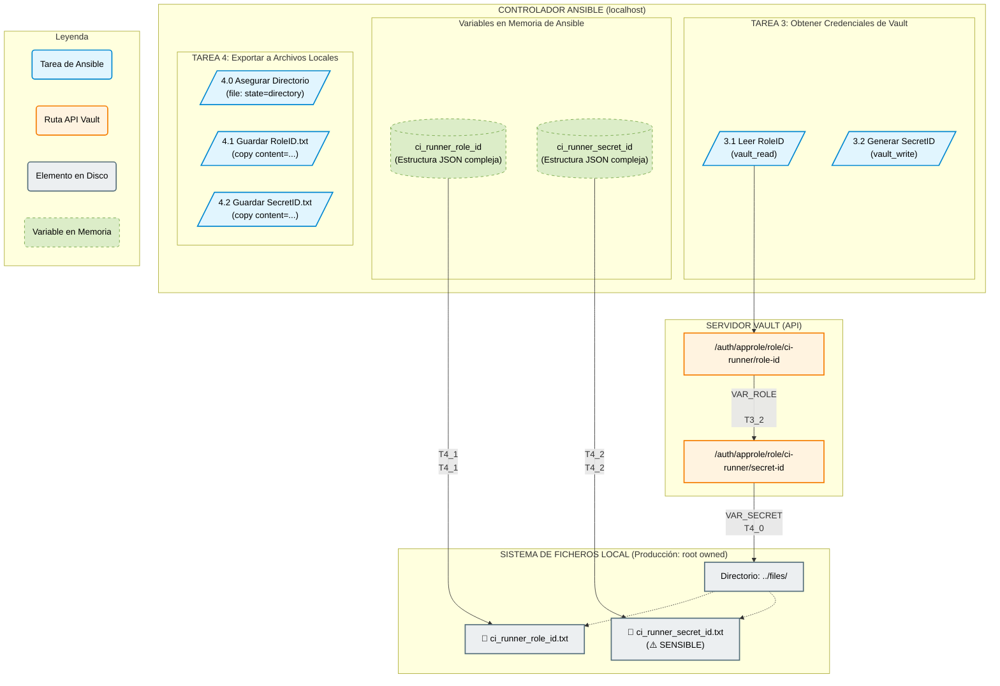

# Ansible Role: Vault Server Configuration

Este role se encarga de configurar un servidor HashiCorp Vault en modo desarrollo para habilitar la gestión de secretos dinámicos de PostgreSQL y preparar la autenticación AppRole para la integración con un sistema de CI/CD.

Este role muestra como configurar un servidor HashiCorp Vault en modo desarrollo para simular un entorno completo de 'Secretos como Servicio', conectando Vault con una base de datos PostgreSQL y generando las identidades necesarias para que un pipeline externo pueda autenticarse.

## Descripción General de la Arquitectura



## Flujo de Trabajo Detallado

### Parte 1: Configuración de Motores y Autenticación

Esta sección establece la configuración base de Vault, incluyendo la integración con la base de datos PostgreSQL y la definición de políticas y roles de autenticación necesarios para el flujo de trabajo.

#### Flujo de Automatización con Ansible para la Obtención y Almacenamiento Seguro de Credenciales AppRole (RoleID y SecretID)

Este despliegue tiene un objetivo principal: Sustituir el peligroso Token Root por un sistema de "menor privilegio".

En lugar de usar una llave maestra para todo, estamos construyendo una "puerta lateral" específica para que tu Runner de CI/CD solo pueda entrar a recoger credenciales de base de datos temporales y nada más.

Vamos a desglosar el diagrama anterior, pieza por pieza, viendo el código que lo hace realidad.

##### Parte 1: El Lado de la Base de Datos (El Tesoro)
En esta parte configuramos la "fábrica de credenciales". Vault necesita permiso para acceder a PostgreSQL y una plantilla para saber cómo crear usuarios.

###### 1. El Motor (DB_ENGINE) y la Conexión Admin (DB_CONFIG)

Función: Primero, "encendemos" la capacidad de Vault para manejar bases de datos (Tarea 1.2). Después, le damos a Vault las llaves del reino: el usuario y contraseña de superusuario (postgres) de tu servidor real (Tarea 1.3).

Por qué es vital: Sin esto, Vault no puede conectarse a tu PostgreSQL 10.0.0.31 para crear y borrar usuarios dinámicamente.

```YAML
# --- Código Ansible: Habilitar motor y configurar conexión ---
- name: 1.2 Habilitar el motor de secretos dinamicos 'database/'
  community.hashi_vault.vault_write:
    url: "{{ vault_addr }}"
    token: "{{ vault_token }}"
    path: sys/mounts/database
    data:
      type: database
# ... (luego sigue la Tarea 1.3 que configura la conexión_url, username y password) ...
```


###### 2. La Plantilla de Credenciales (DB_ROLE)

Función: Creamos el rol runner_role. Esto no es un usuario, es una receta. Define el SQL exacto que Vault ejecutará cuando le pidan credenciales, y cuánto tiempo vivirán esas credenciales (1 hora).

Por qué es vital: Aquí limitamos el daño. El SQL define que los usuarios creados solo tendrán permisos de SELECT, INSERT, UPDATE, y no podrán, por ejemplo, borrar tablas (DROP).

```YAML

# --- Código Ansible: Definir la receta SQL ---
- name: 1.4 Crear el Rol 'runner_role' para credenciales temporales
  community.hashi_vault.vault_write:
    # ...
    path: database/roles/runner_role
    data:
      db_name: postgresql
      creation_statements: |
        CREATE ROLE "{{name}}" WITH LOGIN PASSWORD '{{password}}' VALID UNTIL '{{expiration}}';
        GRANT SELECT, INSERT, UPDATE ON ALL TABLES IN SCHEMA public TO "{{name}}";
      default_ttl: "1h"
      max_ttl: "24h"
    # ... (vars para escapar las llaves)
```

#### Parte 2: El Lado de la Autenticación (La Llave y el Permiso)
Aquí definimos quién puede entrar y qué se le permite hacer una vez dentro.

###### 3. El Método de Autenticación (AUTH_METHOD) y la Identidad (APPROLE)

Función: Habilitamos AppRole (Tarea 2.2), que es el estándar para autenticación de máquinas. Luego, creamos una identidad específica llamada ci-runner (Tarea 2.3).

Por qué es vital: Esta es la credencial que sustituye al Root Token. Tu Runner de GitHub usará un RoleID y un SecretID asociados a este ci-runner para hacer "login" en Vault.

```YAML

# --- Código Ansible: Habilitar AppRole y crear la identidad ci-runner ---
- name: 2.2 Habilitar el método de autenticación AppRole
  community.hashi_vault.vault_write:
    # ...
    path: sys/auth/approle
    data:
      type: approle

- name: 2.3 Crear el AppRole 'ci-runner' y vincular la política
  community.hashi_vault.vault_write:
    # ...
    path: auth/approle/role/ci-runner
    data:
      policies: ["runner-policy"] # <-- ¡Aquí se vincula la política!
      # ... (TTLs)
```


###### 4. El Firewall de Permisos: La Política (POLICY)

Función: Creamos la política runner-policy. Esta es la pieza de seguridad más importante. Es una lista blanca muy estricta.

Por qué es vital: Fíjate en el código. Solo permite read en UNA ruta específica: database/creds/runner_role. Si un atacante roba las credenciales del runner, solo podrá pedir usuarios de base de datos. No podrá leer otros secretos, ni cambiar configuraciones, ni usar el token root. Es el principio de mínimo privilegio aplicado.

```YAML

# --- Código Ansible: Definir la política de permisos mínimos ---
- name: 2.1 Crear la política 'runner-policy' (solo permisos de lectura)
  community.hashi_vault.vault_write:
    # ...
    path: sys/policy/runner-policy
    data:
      policy: |
        path "database/creds/runner_role" {
          capabilities = ["read"]
        }
        # ... (revoke capability)
```

##### Resumen del Flujo Futuro (Cómo funcionará en producción)
Una vez que este Ansible ha terminado su trabajo, el flujo en tu pipeline de CI/CD será el siguiente:

Autenticación: Tu Runner de GitHub "llamará a la puerta" de Vault usando las credenciales del AppRole ci-runner (Tarea 2.3).

Autorización: Vault le dejará pasar y le asignará un token temporal que tiene pegada la política runner-policy (Tarea 2.1).

Petición: El Runner, usando ese token, pedirá: "Necesito credenciales para la base de datos", intentando leer la ruta database/creds/runner_role.

Ejecución: Vault comprobará la política. Como está permitido, Vault irá a la "receta" runner_role (Tarea 1.4), usará la conexión admin (Tarea 1.3) para conectarse a PostgreSQL, creará un usuario temporal con el SQL definido, y le devolverá el usuario y contraseña al Runner.


### Parte 2: Extracción y Almacenamiento Seguro de Credenciales AppRole

Esta sección se encarga de interactuar con la API de Vault para obtener el RoleID y generar un nuevo SecretID dinámico, extrayendo y almacenando estas credenciales de forma segura para su uso posterior por el sistema de CI/CD.

Vemos como automatizar el proceso de obtención de las credenciales de AppRole (RoleID público y SecretID sensible) desde Vault y su almacenamiento en el sistema de archivos local, preparando el entorno para la autenticación de máquinas.

**Diagrama de Flujo de Datos:**


**Explicación de Tareas:**
📝 Detalle de las Actividades
TAREA 3: Obtener las Credenciales desde Vault
Esta fase se encarga de interactuar con la API de Vault para conseguir los identificadores en crudo.

3.1. Obtener el RoleID (El Identificador Público)

Qué hace: Lee una ruta específica en Vault donde siempre está disponible el ID fijo del rol ci-runner. Es una operación de lectura (vault_read), no cambia nada en Vault.

Resultado: Guarda toda la respuesta JSON de Vault en la variable ci_runner_role_id.

```YAML

- name: 3.1 Obtener RoleID del AppRole 'ci-runner'
  community.hashi_vault.vault_read:
    # ... conexión ...
    path: auth/approle/role/ci-runner/role-id
  register: ci_runner_role_id
  # ...
```

3.2. Generar y obtener SecretID (La Contraseña Dinámica)

Qué hace: A diferencia del RoleID, el SecretID no "existe" hasta que se pide. Esta tarea escribe (vault_write) en una ruta especial que le indica a Vault: "¡Genera una nueva contraseña para este rol ahora mismo!".

Resultado: Vault crea un SecretID nuevo (con un tiempo de vida de 1 hora, según configuramos antes) y devuelve sus detalles en un JSON, que Ansible guarda en la variable ci_runner_secret_id.

```YAML

- name: 3.2 Generar y obtener SecretID del AppRole 'ci-runner'
  community.hashi_vault.vault_write:
    # ... conexión ...
    path: auth/approle/role/ci-runner/secret-id
  register: ci_runner_secret_id
  # ...
```

TAREA 4: Exportar y Guardar en Disco (Entorno de Producción)
Esta fase toma los datos complejos en memoria y los convierte en archivos de texto plano utilizables. Se ejecuta con privilegios elevados (become: true implícito en tu configuración), por lo que los archivos resultantes pertenecerán a root.

4.0. Asegurar el Directorio de Destino

Qué hace: Antes de intentar escribir archivos, se asegura de que la carpeta contenedora (../files) exista.

Por qué es importante: Evita que el playbook falle si es la primera vez que se ejecuta en un entorno limpio. Al ejecutarse con sudo, si la carpeta no existe, la creará como propiedad de root.

```YAML

- name: 4.0 Asegurar que existe el directorio 'files' en la raíz
  ansible.builtin.file:
    path: "{{ playbook_dir }}/../files"
    state: directory
    mode: '0755'
  # ...
```

4.1 y 4.2. Guardar RoleID y SecretID

Qué hacen: Estas tareas usan el módulo copy para crear archivos de texto. La parte crucial es cómo extraen la información. Como descubrimos en el debug, las variables de Ansible contienen una estructura JSON anidada. Usamos la notación de punto variable.data.data.valor para navegar hasta el dato exacto que necesitamos.

Seguridad (Producción): Los archivos se crean como root. Esto es bueno en un servidor real, ya que impide que usuarios no privilegiados lean el SecretID. En tu Mac, tendrás que usar sudo cat ... para ver su contenido.

⚠️ Advertencia Crítica: El archivo ci_runner_secret_id.txt contiene una credencial de alto privilegio en texto plano. Este es un paso intermedio necesario para llevarlo a la CI/CD, pero este archivo nunca debe quedar expuesto o subirse al control de versiones.

```YAML

- name: 4.1 Guardar RoleID en un archivo local para uso en la CI
  ansible.builtin.copy:
    # Navegamos la estructura JSON para obtener solo la cadena del ID
    content: "{{ ci_runner_role_id.data.data.role_id }}"
    dest: "{{ playbook_dir }}/../files/ci_runner_role_id.txt"
    # ...

- name: 4.2 Guardar SecretID en un archivo local (REQUIERE CIFRADO)
  ansible.builtin.copy:
    # Navegamos la estructura JSON para obtener solo la cadena del ID
    content: "{{ ci_runner_secret_id.data.data.secret_id }}"
    dest: "{{ playbook_dir }}/../files/ci_runner_secret_id.txt"
    # ...

```

## Archivos Generados

Este role generará los siguientes archivos en el controlador de Ansible (en la carpeta `files/` del proyecto raíz):

* `ci_runner_role_id.txt`: Identificador público del rol.
* `ci_runner_secret_id.txt`: **(SENSIBLE)** Contraseña dinámica para el rol. Pertenecerá a root en entornos de producción.


# Actualizar el CI/CD con AppRole

Hasta ahora, tu workflow de CI/CD probablemente se autentica con el Token Root, que es una práctica de seguridad muy pobre. Vamos a sustituirlo por el RoleID y SecretID que acabamos de generar.Paso 1: Obtener las CredencialesLocaliza los dos archivos que Ansible creó en tu directorio files/ (o en la raíz del playbook, dependiendo de dónde estabas cuando lo ejecutaste):RoleID (público):Bashcat files/ci_runner_role_id.txt
# Ejemplo: a2b3c4d5-e6f7-8901-2345-67890abcdef0
SecretID (secreto):Bashcat files/ci_runner_secret_id.txt
# Ejemplo: 0fedcba9-8765-4321-fecb-a9876543210f
Copia estos dos valores.Paso 2: Configurar los Secretos en GitHubDebes añadir estos dos valores como secretos en tu repositorio de GitHub, al igual que hiciste con el Token Root y la llave de desbloqueo.Ve a Settings de tu repositorio.Navega a Security > Secrets and variables > Actions.Crea dos nuevos secretos del repositorio:Nombre del Secreto (Nuevo)ValorVAULT_ROLE_IDPega el contenido de ci_runner_role_id.txtVAULT_SECRET_IDPega el contenido de ci_runner_secret_id.txt

Despues de esto acualizamos el workflow de github (bdd_test.yml) para que use esos secretos